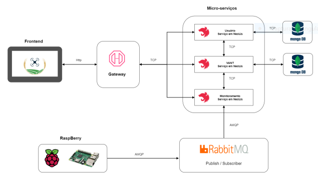

# PI2 GRUPO 3-VANT


## Diagrama Arquitetural




## Serviços

###  Frontend
É a camada de interface entre usuário e o sistema. Para a construção da interface
será utilizada a biblioteca em React JS, com o intuito do desenvolvimento da interface de
acordo com o protótipo idealizado.
Para o projeto do VANT foi optado pela biblioteca Material-UI por ter um design
bastante conhecido e utilizado em grandes aplicações da Google, por exemplo no Gmail.
Com o Material-UI tem-se a capacidade de desenvolver aplicações com componentes responsivos de forma fácil.


### Gateway de API
Este micro serviço auxilia no gerenciamento de APIs e se encontra entre o serviço
de front-end e os demais microsserviços presentes no projeto. O Gateway de API recebe
todas as chamadas da API, repassa para o micro serviço responsável por aquela chamada
e depois retorna o resultado apropriado, utilizará tokens com o padrão JWT para realizar
a autenticação do usuário para rotas protegidas (REDHAT, 2021).

### Monitoramento
O serviço de Monitoramento(monitoring) é responsável pela comunicação com o
RabbitMQ, implementando um consumidor que assinará um tópico exclusivo para cada drone que tiver seu monitoramento solicitado. O padrão de mensagem publisher-subscriber
permitirá o desacoplamento entre o publisher (publicador), aplicação presente na raspberry, e o subscriber (assinante), serviço de monitoramento. Os dados recebidos serão
repassados para o usuário que realizou a solicitação de monitoramento e para o serviço
VANT para que os dados possam ser armazenados.

###  VANT
O serviço de VANT é responsável por coletar e armazenar os dados cadastrados
pelo usuário, assim como os dados coletados pelo VANT durante cada voo. Os dados referentes ao cadastro do VANT advém da comunicação com o frontend através da gateway,
enquanto os dados referentes aos voos, serão coletados através da comunicação com o
serviço de monitoramento.

###  Usuário
O serviço de usuário (User) será responsável por armazenar e gerenciar dados
referentes aos usuários da aplicação, fornecendo serviços de cadastro, edição, autenticação
e deleção. Para os microsserviços de Gateway, VANT, Usuário e Monitoramento, foram
definidos o framework Nest. Justificada a utilização deste framework no tópico.

## Desmonstração
    Video de demonstração disponivel na pasta data.

## Manual de instalação

### Requisitos
  Possuir instalado e configurado:
  - [docker](./data/P2_Monitoring.mp4)
  - [docker-compose](https://docs.docker.com/compose/install/)
  - git

### Instruções

####  Passos(Linux)
	Utilize o Makefile para realizar o download dos codigos, rodar/parar/apagar os containers com os serviços e remover os diretorios.
1. Download dos codigos:

    ``$ make install`` 

2. Subir os container:

    ``$ make run``

3. Parar e apagar os container:

    ``$ make down`` 

4. Remover diretorios:

    ``$ make clear`` 

#### Passos(Windows)
  
  1. Download dos codigos:

          git clone https://github.com/PI2-VANT/Backend-User.git

          git clone https://github.com/PI2-VANT/Backend-Monitoring.git

          git clone https://github.com/PI2-VANT/Backend-VANT.git

          git clone https://github.com/PI2-VANT/Frontend.git
          
          git clone https://github.com/PI2-VANT/Backend-Gateway.git

    

2. Subir os container:

        docker-compose -f ./Backend-User/docker-compose.yml up -d

        docker-compose -f ./Backend-Monitoring/docker-compose.yml up -d

        docker-compose -f ./Backend-VANT/docker-compose.yml up -d

        docker-compose -f ./Frontend/docker-compose.yml up -d

        docker-compose -f ./Backend-Gateway/docker-compose.yml up -d

3. Acessar aplicação:

        http://localhost:3000

4. Parar e apagar os container:


        docker-compose -f ./Backend-User/docker-compose.yml down

        docker-compose -f ./Backend-Monitoring/docker-compose.yml down

        docker-compose -f ./Backend-VANT/docker-compose.yml down

        docker-compose -f ./Frontend/docker-compose.yml down

        docker-compose -f ./Backend-Gateway/docker-compose.yml down

	

4. Remover diretorios:


        rm -rf ./Backend-User

        rm -rf ./Backend-Monitoring

        rm -rf ./Backend-VANT

        rm -rf ./Frontend

        rm -rf ./Backend-Gateway


#### Script de simulação

Script para fazer a simulação de um voo com o vant, onde os dados simulados serão passados para os serviços.

Possuir instalado e configurado:
- python3
- biblioteca pika 

Para executar:
- ir para diretorio do serviço de monitoramento
    
    - execute:
        
        ```$ python3 sender.py```


#### Para monitorar

Após efetuar seu cadastro, cadastre um vant(pelo navegador http://localhost:3000) com o registrationCode **oo2x**. Execute o script sender.py(passo anterior) e no navegador clic no vant, monitorar.